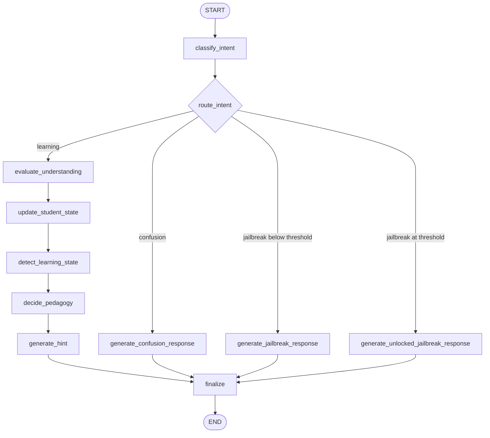

# Tutor Graph Documentation

The SocraticCS tutor backend is implemented in `backend/app/tutor_graph.py` as a LangGraph `StateGraph`. The graph turns one student message plus the current session state into one assistant response and an updated session state.

## State Shape

The graph receives a `TutorGraphState` and runs with a `GraphState` dictionary. Important fields:

- `user_message`: latest student message.
- `conversation_history`: prior messages converted into LLM chat context.
- `session_state`: the current `SessionState` object from the frontend.
- `topic`: detected CS topic, such as `Recursion` or `OOP Concepts`.
- `intent`: guardian classification: `learning`, `confusion`, or `jailbreak`.
- `evaluation`: structured evaluator output with score, mastered concepts, and gaps.
- `learning_state`: derived state: `mastered`, `deeply_struggling`, `struggling`, `confused`, or `progressing`.
- `pedagogy`: strategy object used to generate the next response.
- `response`: final assistant text.
- `updated_state`: returned session state.

## Graph Flow

## Node Responsibilities

- `classify_intent`: uses structured output to classify the message.
- `route_intent`: sends the turn down the learning, confusion, blocked jailbreak, or unlocked-answer path.
- `evaluate_understanding`: estimates the student’s current understanding and identifies concepts/gaps.
- `update_student_state`: merges evaluation into the long-lived session model.
- `detect_learning_state`: converts score, intent, and hint count into a teaching state.
- `decide_pedagogy`: chooses the response strategy: Socratic question, analogy, reframe, near-answer, or celebration.
- `generate_hint`: creates the normal Socratic tutor response.
- `generate_confusion_response`: creates a short empathetic response for confused/frustrated students.
- `generate_jailbreak_response`: blocks direct-answer requests when the student is below the unlock threshold.
- `generate_unlocked_jailbreak_response`: gives a direct explanation once the student reaches the threshold.
- `finalize`: appends the assistant message, preserves the user message if needed, increments hint count for learning turns, and returns the updated session.

## Hint Count vs Hint Level

`hint_count` is the total number of learning hints in a session and can keep increasing forever.

`pedagogy.hint_level` is the instructional intensity used inside the graph and is capped from `0` to `5`. This prevents validation errors while still letting the UI show `hint 6`, `hint 10`, and beyond.

## Jailbreak Unlock Rule

The backend keeps a `jailbreak_threshold` on `SessionState`, defaulting to `70`.

- If `intent == "jailbreak"` and `understanding_score < jailbreak_threshold`, the graph blocks direct answers.
- If `intent == "jailbreak"` and `understanding_score >= jailbreak_threshold`, the graph routes to `generate_unlocked_jailbreak_response`.

The visible threshold slider was removed from the frontend, so new sessions use the backend/default value unless another client sets it.

## Failure Behavior

Structured-output parsing failures fall back safely:

- Intent fallback: `learning`.
- Evaluation fallback: score `30`, no concepts, no gaps.

Missing `GROQ_API_KEY` raises a clear FastAPI `500` error before attempting a model call.

## Extension Points

Good places to extend the tutor:

- Add a `quiz` strategy in `decide_pedagogy` after mastery.
- Add a `feynman_check` node after `generate_hint` to ask the student to explain back.
- Persist `SessionState` in a database instead of localStorage.
- Store per-user thresholds and preferences once authentication exists.
